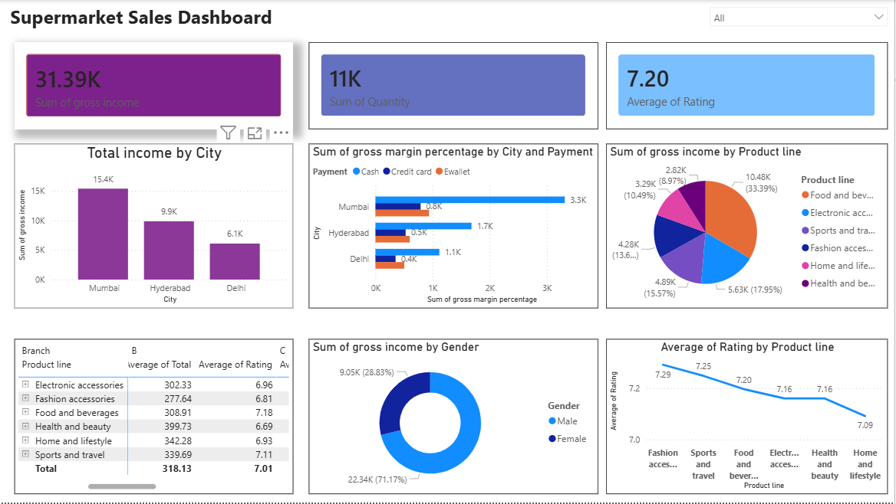

# 📊 Supermarket Sales Dashboard | Power BI

## Project Overview

This Power BI dashboard analyzes supermarket sales data and provides business insights into revenue, customer ratings, product performance, and payment methods.

## Key Metrics

- Total Gross Income: 31.39K
- Total Quantity Sold: 11K
- Average Rating: 7.20

## Dashboard Features

- City-wise Revenue Analysis
- Product Line Performance
- Gender-wise Sales Analysis
- Payment Method Analysis
- Customer Rating Analysis
- Interactive Dashboard Filtering

## Tools Used

- Power BI
- Excel
- DAX
- Data Visualization

## Dashboard Preview

## Key Insights

- Mumbai generated the highest revenue.
- Food & Beverages was the top-performing category.
- Average customer rating remained above 7.
- Sales patterns varied across cities and payment methods.

## Files Included

- Power BI Dashboard (.pbix)
- Dataset (.xlsx)
- Dashboard Screenshot

## Author

Sai Phanindra
